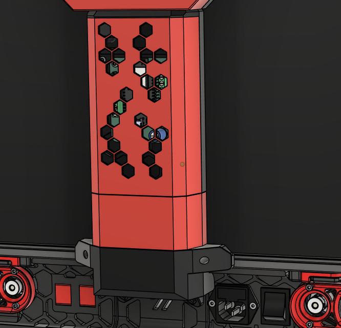

---
search:
  boost: 2 
---

## Umbilical Cables
An umbilical cable is required for each toolhead. They typically route from a [distribution board](../electronics/distro_boards.md) to a [toolhead board](../electronics/th_boards.md). On a StealthChanger, keeping the tool's umbilical in a controlled state is extremely important. If a tool's umbilical were to obstruct any of the other tools, it could result in a crash and cause a print failure. 

To help the umbilical move in a controlled fashion, we employ the use of a flat spring steel or piano wire. This addition gives the umbilical a controlled arc and helps it return to its resting position safely.

!!! tip "Spring Steel?"
    Flat spring steel (3x0.3mm) is the preferred aid for the tool's umbilical. It provides better lateral control and is what comes supplied as part of the LDO `Toolhead and Dock Kit`.

{:width="540"}

## Fanny Pack
Originally by [ManCheetah](https://www.printables.com/@EddieSha_454383){:target="_blank"}, the Fanny Pack has been adopted by DraftShift Design as the de facto method of housing a [distribution board](../electronics/distro_boards.md) on the rear of the printer. Compared to the original, our updated version brings compatibility with a number of [distribution boards](../electronics/distro_boards.md) and buck converter options.

{:width="540"}

## Wire Duct
The Wire Duct serves as a conduit between the [Fanny Pack](#fanny-pack) and your printers electronics bay. Under its cover is an EMS compatible panel for you to mount any extra pieces you might need. 

{:width="540"}

## Assembly
See the [Build Guides](../hardware/guides/cable_management/index.md) for assembly instructions.