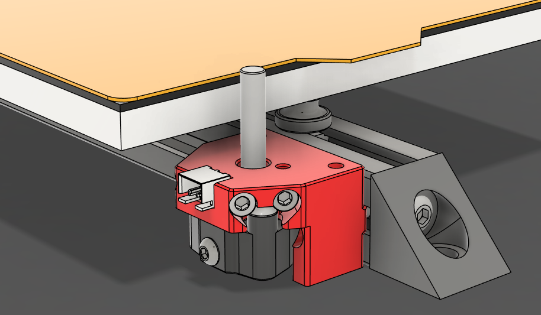

---
search:
  boost: 2 
---

## Sexball Probe
The Sexball gets its rather raunchy name from being a derivative of [Sexbolt Z Endstop](https://github.com/VoronDesign/VoronUsers/tree/main/printer_mods/hartk1213/Voron2.4_SexBolt_ZEndstop){:target="_blank"}. The addition of a ball at the end of the shaft allows us to do multi directional (XYZ) probing.

Converting an existing [Sexbolt Z Endstop](https://github.com/VoronDesign/VoronUsers/tree/main/printer_mods/hartk1213/Voron2.4_SexBolt_ZEndstop){:target="_blank"} is easy, all you need is to replace the existing shaft with a M5 threaded (one end) shaft and 12mm threaded ball.

!!! warning "Not just any Z endstop"
    Only Z endstops with a bushing are recommended for use as a Sexball Probe. If your Z endstop is the style with a deflanged pulley, you will need to source the another.

{:width="540"}

!!! tip "LDO Kit"
    All of the hardware components for a Sexball Probe come as a part of LDO's Base StealthChanger Kit.

## Community Tools

### Axiscope

Axiscope is a specialized tool created by members of our community that is designed to simplify the calibration process for multi-tool 3D printers running [Klipper-toolchanger](../software/index.md#klipper-toolchanger){:target="_blank"} using camera-assisted alignment.

It provides a streamlined web interface for:

* Manual XY calibration using camera feedback.
* Automatic Z alignment through use of a Z endstop or [Sexball Probe](#sexball-probe).
* Quick and precise tool alignment.
* No calculations required, the offsets are given to you in the exact format used with [Klipper-toolchanger](../software/index.md#klipper-toolchanger).

{:width="540"}

!!! tip "Which Camera?"
    Axiscope can technically use any webcam, but its recommended to use a camera that is built for purpose. See our build guide on how to assemble a camera specifically for Axiscope or consider [Ember Prototype's CXC camera](https://www.emberprototypes.com/products/cxc){:target="_blank"}.

More information can be found on the [Axiscope Github](https://github.com/nic335/Axiscope){:target="_blank"}.

### Nudge

Nudge is a multi axis probe where the shaft is suspended in a wobbler using magnets and screws. Nudging the probe in any axis breaks contact with screws within the probe which triggers the probe.

{:width="540"}

For more information and build instructions, visit the [Nudge GitHub](https://github.com/zruncho3d/nudge){:target="_blank"}.

## Calibration Prints

If you don't have any nozzle calibration aids at your disposal, test prints are a simple and reliable way to get your nozzles aligned. 

Test prints work by doing a print with 2+ tools and studying the alignment manually. Adjust the offset by the measured amount and print again. Repeat these steps until you are happy with alignment.

<iframe src="https://www.printables.com/embed/201707" width="300" height="340" scrolling="no" frameborder="0"></iframe>
<iframe src="https://www.printables.com/embed/1092898" width="300" height="340" scrolling="no" frameborder="0"></iframe>