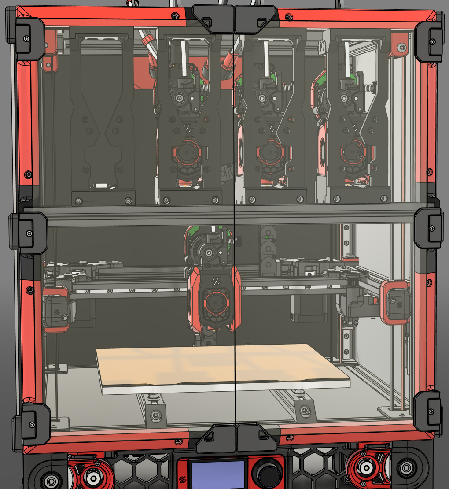

---
search:
  boost: 2 
---

## Context

{:width="340"}

### The Problem
To give the [Modular Docks](modular_dock.md) the maximum amount of rigidity, they need to be supported above and below. Adding an extrusion [crossbar](#crossbar) solves that problem but also introduces another. With the crossbar in line with the frame the standard Voron V2 front-idlers collide with the crossbar and moving the extrusion outside of the frame doesn't allow the door to be mounted anymore.

{:width="340"}

### The Solution
Adding a Door Buffer provides a means to install the [crossbar](#crossbar) and retain the ability to mount the door on the front. The Door Buffer uses 3d printed pieces to fill the gaps around the front of the printers frame and adds new mounting points for the door.

{:width="340"}

There's versions of the Door Buffer for both [standard Voron V2 doors](https://github.com/DraftShift/DoorBuffer/tree/main/STL/Stock%20Voron){:target="_blank"} and the [ClickyClack Fridge Door Mod](https://github.com/DraftShift/DoorBuffer/tree/main/STL/Clicky-Klack){:target="_blank"}, as well as options for [Micron](https://github.com/DraftShift/DoorBuffer/tree/main/STL/Micron){:target="_blank"}.

!!! info "Alternatives"
    You don't necessarily need to use printed pieces to act as a buffer. There are some other methods that the community uses.

    * **2020/1515 Extrusion** - Using blind joints you can mount extrusion to the front of the frame essentially making it 4020/3015.
    * **4020/3015 Extrusion** - Build the front of your printers frame using larger extrusion. 
    * **Mini/Micro BFI** - [Mini/Micro BFI](https://github.com/DraftShift/StealthChanger/tree/main/UserMods/BT123/MiniBFI%20%2B%20MicroBFI){:target="_blank"} takes a different approach and shortens the BFI idlers. This means the [crossbar](#crossbar) can be kept within the printers frame at the cost of less printable area and reduces how much you can adjust the AB belts.

## Crossbar
The crossbar is a piece of extrusion mounted to the front of the printer’s frame, providing a rigid and stable attachment point for the [Modular Dock](modular_dock.md).

The crossbar should be made from extrusion that matches your printer, 2020 for Voron or 1515 for Micron. The length of the crossbar changes depending on the size of your frame and which version of Door Buffer you are using.

| Printer | DraftShift Crossbar | LDO Crossbar |
| --- | --- | --- |
| Voron 250 | 400mm | 370mm |
| Voron 300 | 450mm | 420mm |
| Voron 350 | 500mm | 470mm |
| Micron 180 | 302mm | - |

!!! tip "Crossbar Adapter"
    You can use the DraftShift Door Buffer with LDO length extrusions by using an [adapter](https://github.com/DraftShift/DoorBuffer/tree/main/STL/Adaptor){:target="_blank"}.

!! info "Monolith AWD"
    With monolith protrusion the front motors would hit the crossbar even with the door-buffer. To work around that you can use one of the following usermods
    - [printed adapter for door buffer with crossbar and Monolith AWD](https://github.com/DraftShift/DoorBuffer/tree/main/UserMods/MikeYankeeOscarBeta/Doorbuffer_Adapters){:target="_blank"}
    - [printed adapter for crossbar with doomcube 4040 frame and Monolith AWD](https://github.com/DraftShift/ModularDock/tree/main/UserMods/MikeYankeeOscarBeta/Monolith_Crossbar){:target="_blank"}

## Assembly
The assembly guide for the Door Buffer can be found in the [Build Guides](guides/door_buffers/index.md) section.
