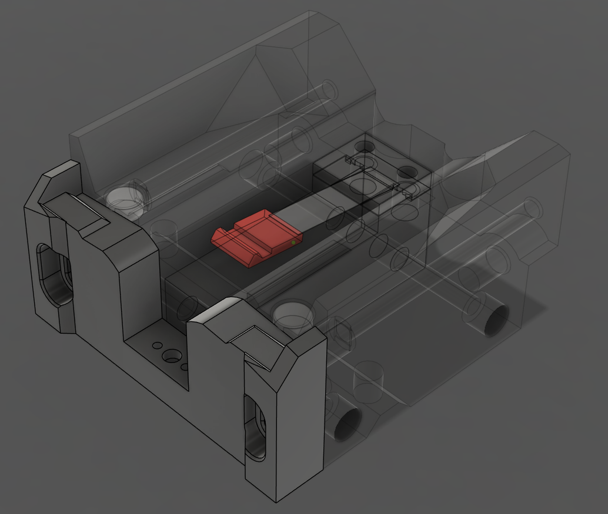

---
search:
  boost: 2 
---

The Modular Dock gives you a place to rest the tools while they are not in use. Its modular design allows for flexible configurations to suit any printer and toolhead combination.

## Application
The Modular Dock can be used in a variety of ways. The most common and recommended way is to use it in combination with a [crossbar](door_buffer.md#crossbar). The [crossbar](door_buffer.md#crossbar) is a part of the [Door Buffer](door_buffer.md) and offers a sturdy mounting point for the dock to be supported both above by the frame and below by the [crossbar](door_buffer.md#crossbar).

Alternatively, the dock can be mounted to the printer's frame using the [Stabilizers](#stabilizers) and [Link](#links) components. This keeps the lower portion of the docks in place by joining them together while the outer docks get supported by the side of the printers frame. This adds some rigidity, but will not provide the same level of stability as the [crossbar](door_buffer.md#crossbar).

Finally, the docks can be hung from the top of the printers frame with no lower support. This is the least stable option, should only used when the other options are not available to you. If you choose to go for top-mounted docks it's recommended to mount extra corner brackets to avoid the top-extrusion twisting around the blind joints.

## Modularity
Because of its modularity, the Modular Dock has many differing pieces that can become overwhelming rather quickly. To help navigate the options, the modular dock is broken down into the following subcomponents:

* [Base](#base) - The section that the tool rests on while docked.
* [Blocker](#blocker) - A section that mounts inside the [base](#base) and blocks the nozzle while docked, helping with ooze control.
* [Back](#back) - Attaches to the rear of the [base](#base) to allow adjustment of the tools resting position.
* [Wiper](#wiper) - A means of wiping the nozzle as the toolhead is exiting the dock.
* [Frame](#frame) - The upright portion of the dock that connects to the top of the printer's frame and optionally a [crossbar](door_buffer.md#crossbar).
* [Links](#links) - Attaches to the bottom of the docks, increasing rigidity for hanging docks.
* [Stabilizers](#stabilizers) - Ties the docks in to the side of the frame, further increasing rigidity for hanging docks.
* [Containers](#containers) - An optional addon that add a bit of flair to the front of the dock.

## Components
### Base
The base is a large section that is toolhead specific which has been shaped to match the bottom of the toolhead. It defines the width of the dock and helps define the position that the tool sits in on the Y Axis. The base can be availiable in 2 variants, `standard` and `stubby`. Every toolhead has a `standard` base, but not all toolheads have the smaller `stubby` base.

!!! warning "Smaller is better right?"
    The `stubby` base is **NOT** compatible when using a [Door Buffer](door_buffer.md). If you are using a [Door Buffer](door_buffer.md), you MUST use the `standard` base. 

| Base - Standard | Base - Stubby |
| :-: | :-: |
|  |  |

### Blocker
The Blocker is a section that is toolhead agnostic and mounts inside the [Base](#base). It serves as a barrier to prevent ooze while the tool is docked. It is availiable in 2 variants, `cup` and `spring steel`. 

There is no real advantage using one over the other, its more about what you have available to you.

The `cup` version uses a pen spring, screw and heatset insert, while the `spring steel` version uses a strip of flat spring steel. Both versions use high temperature RTV silicone to block the nozzle.

!!! tip "LDO Toolhead and Dock Kit"
    The LDO Toolhead and Dock Kit includes pre moulded `spring steel` blockers. If you are using the LDO kit, you will need to print the `spring steel` variant.

| Blocker - Cup | Blocker - Spring Steel |
| :-: | :-: |
|  |  |

### Back
The Back plate is toolhead specific and bolts to the rear of the [Base](#base). Adjusting it up or down can help maintain the tool's alignment while it is docked.

| Back |
| :-: |
| {:width="340"} |

### Wiper
The Wiper is toolhead agnostic and mounts to the [Back](#back) plate. There are 2 variants, `ptfe` and `bambu`. Both use a piece of PTFE tube to wipe the nozzle as it exits the dock. The `bambu` version emulates the wiper from the P1/X1 series of printers and can be printed or purchased from [BambuLab](https://bambulab.com){:target="_blank"}.

!!! tip "Wipers Are Considered Optional"
    If you get excess ooze while returning to the print, a wiper may help.

| Wiper - PTFE | Wiper - Bambu |
| :-: | :-: |
|  |  | -->

### Frame
The Modular Dock Frame can be considered to be the front of the dock. It consists of left, right, top and bottom pieces. 

The left and right pieces come in 2 variants, `standard` and `short`. This determines the height of the dock. 

!!! warning "Short Frame Saves More Space?"
    Using the `short` version of the Frame can give you more printable area under the bed, but it does have some caveats. 

    * You may need to adjust the position of the z rails to ensure the carriage can reach.
    * [StealthBurner](toolheads.md#stealthburner) is not compatible with short docks.
    * [Containers](#containers) are not compatible with short docks.

There are 2020 and 1515 versions of the top and bottom pieces. Both versions have 2 varients, `standard` and `crossbar`. The `crossbar` is used in combination with [Door Buffer](door_buffer.md), while the standard version can be used for a `crossbar` in-line with the frame or as a combination with [Stabilizers](#stabilizers) or when hanging from the top of the printers frame. Optionally there is also an 'L bracket' that can help with stability of hanging docks.

| Standard Height | Short Height |
| :-: | :-: |
|  |  |

### Links
Links can be used to tie the frame and base of the docks together to gain more rigidity for hanging docks or when using [Stabilizers](#stabilizers). There are seperate links pieces for the [Frame](#frame) and the [Base](#base).

The links for the [Frame](#frame) differ depending on whether your using 2020 or 1515 top and bottom pieces and whether you are using a wider tool or not. The links for the [Base](#base) are the same no matter the configuration.

| Links |
| :-: |
|  |

### Stabilizers
Stabilizers can be added to the first and last dock to help with rigidity for hanging docks. There are left and right brackets for 2020 and 1515 frames which mount on the top Y axis extrusions of the printer's frame, spacers and a brace which connects to the outer docks.

!!! tip "Think ahead"
    * There are different versions of the brace depending on the combination of pieces chosen to build the dock. Make sure to get the correct version.
    * The spacers can be scaled in the slicer to adjust the offset of the docks from the side of the printer. These should be printed last, giving you a change to measure the distance you require.

| Stabilizers |
| :-: |
|  |

### Containers
Containers are an aesthetic addon that can be position in the frame of the Modular Dock. They are considered optional.

| Containers |
| :-: |
|  |

## Assembly
The assembly guide for the Modular Dock can be found in the [Build Guides](guides/modular_docks/index.md) section. There you will find a guide for the different componants and how to contruct the final assembly.
