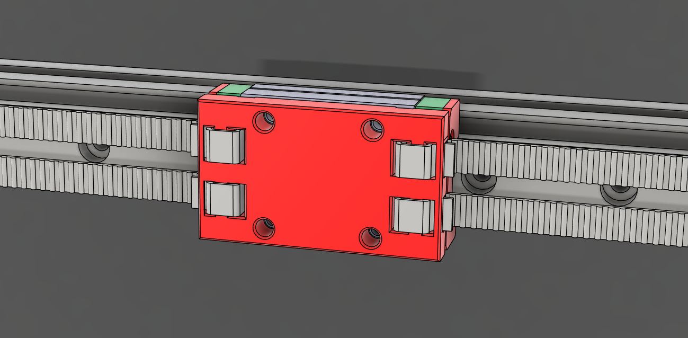
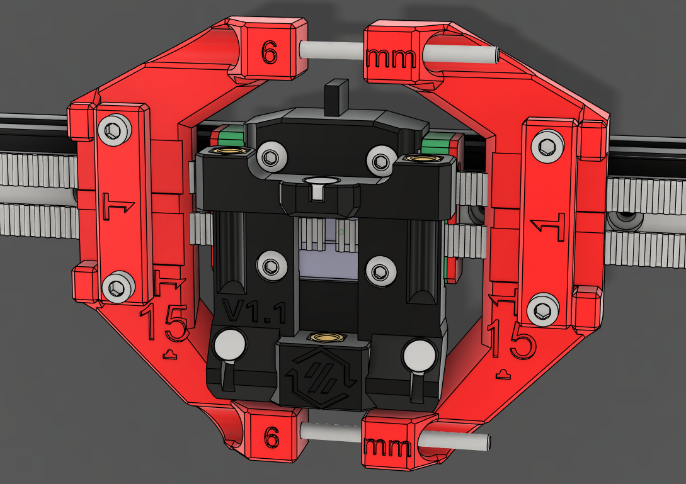
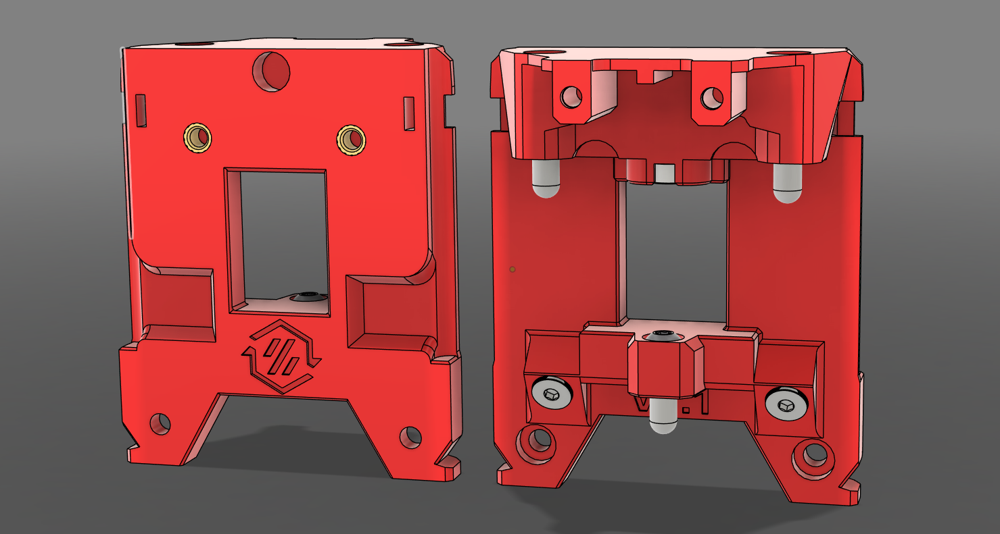

---
search:
  boost: 2 
---

StealthChanger is the key component and namesake of the StealthChanger ecosystem. It can be broken down in to 2 main components, the [Shuttle](#shuttle) and [Backplate](#backplate), which allows the toolhead to be removed from the gantry and be docked so that another tool can be picked up. During operation, the mechanism also behaves like [Voron Tap](https://github.com/VoronDesign/Voron-Tap){:target="_blank"} and can be used for probing the bed.

{: .center }

## Shuttle
The StealthChanger Shuttle gets mounted to the gantry's X-rail MGN carriage and serves the purpose of being a receptacle for the [Backplate](#backplate). It uses bushings and magnets which allow the [Backplate](#backplate) to
kinematically attach to the gantry.

### Printed vs CNC
The printed and CNC versions of the Shuttle both operate in the same way. You can print the shuttle and source the bushings, magnet and screws or purchase a ready to go CNC shuttle. 

CNC Shuttles offer some QOL improvements like improved belt retention and in the case of LDO's Shuttle, precision-machined bushings.

When printing a Shuttle, it is important to note that the selection of material you use and your printers accuracy are important. Please reference the [Print Tuning Section](../getting_started.md#print-tuning) before printing your Shuttle.

!!! warning "ABS+"
    We have found that when used for StealthChanger, ABS+ tends to crack over time and advise against using it.

| Shuttle | MGN12 | MGN9 | Micron | 6mm Belt | 9mm Belt |
| :-: | :-: | :-: | :-: | :-: | :-: |
| Printed | :fontawesome-solid-check:{style="color:green;"} | :fontawesome-solid-asterisk:{style="color:orange;"} | :fontawesome-solid-asterisk:{style="color:orange;"} | :fontawesome-solid-check:{style="color:green;"} | :fontawesome-solid-asterisk:{style="color:orange;"} |
| CNC | :fontawesome-solid-check:{style="color:green;"} | :fontawesome-solid-xmark:{style="color:red;"} | :fontawesome-solid-xmark:{style="color:red;"} | :fontawesome-solid-check:{style="color:green;"} | :fontawesome-solid-check:{style="color:green;"} |

!!! info "*MGN9/Micron"
    The hole spacing on MGN9 is too small to clamp the belts reliably without the screws getting in the way. [Shuttle Keeper](#shuttle-keeper) is required. 

!!! info "*9mm belts"
    9mm belts can be used with CNC Shuttles. If you want to use 9mm belts with a printed Shuttle, a [usermod by BT123](https://github.com/DraftShift/StealthChanger/tree/main/UserMods/BT123/Split%20Keeper){:target="_blank"} is required.

!!! info "monolith and inverted belts"
    Inverted belts with printed shuttle require the use of this [usermod by BT123](https://github.com/DraftShift/StealthChanger/tree/main/UserMods/BT123/Split%20Keeper){:target="_blank"}.
    Inverted belts can be mounted to CNC Shuttle as is, but with monolith this results in slight angled belt-path. To get a straight belt path with CNC-shuttle you can either use [belt-lock](https://github.com/MikeYankeeOscarBeta/belt_lock){:target="_blank"} or this [XY-joint mod by dderg](https://github.com/Monolith3D/Monolith_Gantry/tree/main/UserMods/dderg/XY%20Joints%20compatible%20with%20Fysetc%20CNC%20Stealthchanger%20Shuttle){:target="_blank"}.
    

## Shuttle Keeper
The Shuttle Keeper is an additional component that can be used to hold the belts in place while the [Shuttle](#shuttle) is removed from the MGN Rail. There are situational reasons as to when and why you would want to use a Shuttle Keeper. See the below list for details.

* Only compatible with a printed [Shuttle](#shuttle).
* Required for a MGN9 [Shuttle](#shuttle).
* Optional for a MGN12 [Shuttle](#shuttle).
* Shuttle Keeper moves the toolhead forward 5-6mm.

## Belt Helper
Belt helper is a tool that will hold your belts for you while installing the [Shuttle](#shuttle). Once attached to the belts, the Belt Helper will assist in pulling the belts into position for the [Shuttle](#shuttle) to clamp them.

!!! tip "One tool to rule them all"
    The Belt Helper was designed to assist with installing the printed [Shuttle](#shuttle). It can also be useful with CNC shuttles to give you that extra set of hands you always wanted.

!!! info "Mini/Micro BFI"
    If using [Mini/Micro BFI](https://github.com/DraftShift/StealthChanger/tree/main/UserMods/BT123/MiniBFI%20%2B%20MicroBFI){:target="_blank"}, the Belt Helper is required to pre tension your belts to a point where your idlers only need minimal adjustment.

## Backplate
The StealthChanger Backplate is the companion component to the [Shuttle](#shuttle). Each compatible toolhead has its own unique Backplate that gets bolted to the tool. The backplate is a critical component of StealthChanger and requires you to ensure you have good print accuracy, especially when pairing with a CNC Shuttle. Please reference the [Print Tuning Section](../getting_started.md#print-tuning) before printing your Backplate. For a list of compatible tools, see out [Toolhead Page](toolheads.md).

## Assembly
See the [Shuttle Build Guides](guides/shuttles/index.md) and [Backplate Build Guides](guides/backplates/index.md) sections for assembly instructions.