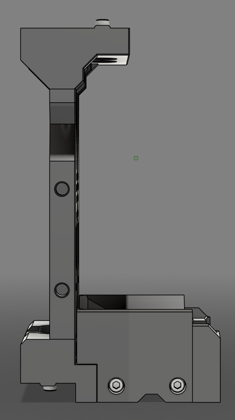

Welcome to the official documentation for StealthChanger and the DraftShift Design ecosystem. This site will provide information on the many components and how to assemble, configure and operate them.

## What is StealthChanger
[StealthChanger](hardware/stealthchanger.md) is the key componant of a larger ecosystem that can be used on Voron and other front mount printers. StealthChanger enables the tool to be completely removed from the gantry making it proficient in tool changing when combined with the rest of the DraftShift Design ecosystem.

## DraftShift Design

{ width=180 align=right }
### StealthChanger
[StealthChanger](hardware/stealthchanger.md) consists of 2 major components, the [Shuttle](hardware/stealthchanger.md#shuttle) and [Backplate](hardware/stealthchanger.md#backplate). The shuttle gets attached to the X-Carriage on the printers gantry, while the backplate gets attached to the back of each tool. This enables any flying gantry printer with front mounted MGN12- or MGN9-rail to become a toolchanger.

{ width=160 align=left } 
### Modular Dock
The [Modular Dock](hardware/modular_dock.md) gives you a place to rest the tools while they are not in use. Its modular design allows for flexible configurations to match any printer and toolhead combination.

{ width=250 align=right } 
### Door Buffer
The [Door Buffer](hardware/door_buffer.md) moves the mounting point of the [Modular Dock](hardware/modular_dock.md) forward, adding a crossbar for greater stability. This also has the added benefit of regaining more of the lost printable area.

{ width=300 align=left } 
### Tophat
The [Tophat](hardware/tophat.md) raises the top panel of the printer to allow room for the tool's [umbilical cables](hardware/cable_management.md#umbilical-cables). There are both [3d printed](hardware/tophat.md#printed-tophat) and [extrusion](hardware/tophat.md#extrusion-tophat) options available.

{ width=250 align=right } 
### Cable Management
Proper [Cable Management](hardware/cable_management.md) plays a critical role in the performance and reliability of [StealthChanger](hardware/stealthchanger.md), though it is frequently underestimated. The [Cable Management](hardware/cable_management.md) section provides guidance on managing [umbilical cables](hardware/cable_management.md#umbilical-cables) for tools, integrating the [Fanny Pack](hardware/cable_management.md#fanny-pack) to house the distribution board, and utilizing [Wire Duct](hardware/cable_management.md#wire-duct) to maintain cable organization.

{ width=250 align=left } 
### Calibration Tools
For [StealthChanger](hardware/stealthchanger.md) to operate accurately, the printer must compensate for any positional offsets between tool nozzles. The [Calibration Tools](hardware/calibration_tools.md) section details the available options for achieving this calibration.